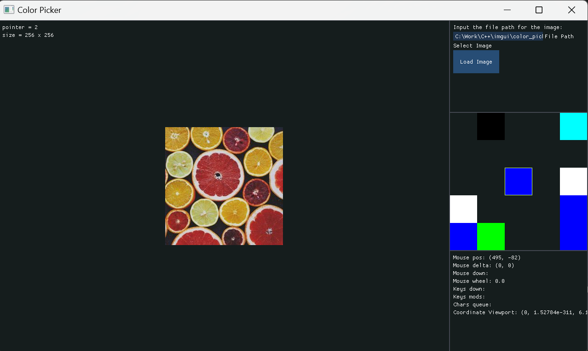

# color_picker
Lightweight GLFW + ImGUI based onscreen color picker application (PoC for ImGui and GLFW integration)

## Features
- Scalable Preview Panel with zoom control for high precision (editable with code).
- Pick pixels from loaded images.
- Zooming enabled for the images loaded for more precise control.
- Resizable window.
- Support for JPG, PNG, TGA, BMP, PSD, GIF, HDR, PIC formats.
- Color Picker with RGB and HSV Conversion.
- Drag and drop functionality to add images onto the window

## Dependencies (Built with)  
-   GLFW 3.4
-   [Dear ImGui](https://github.com/ocornut/imgui)
-   stb_image

### checklist
- [X] Setting up Cmake environment for GLFW  
- [X] Getting the OpenGL window up with GLFW  
- [X] Adding ImGui to Cmake system  
- [X] Integrate ImGui to OpenGL window  
- [X] Rendering of the live pixels in separate window
- [X] Cleaned the directory and class structure
- [ ] Copy to clipboard
- [X] Finalize the format for window design
- [X] Loading of images onto the render window
- [X] Split the rendering of OpenGL into different rendering class
- [X] Correcting the file system
- [X] Display of Color picked
- [X] Converstion to other color spaces (HSV)
- [X] Added drag and drop function to the application
- [ ] Change the title icon with custom one
- [ ] Create Custom Titlebar

## Known bugs
